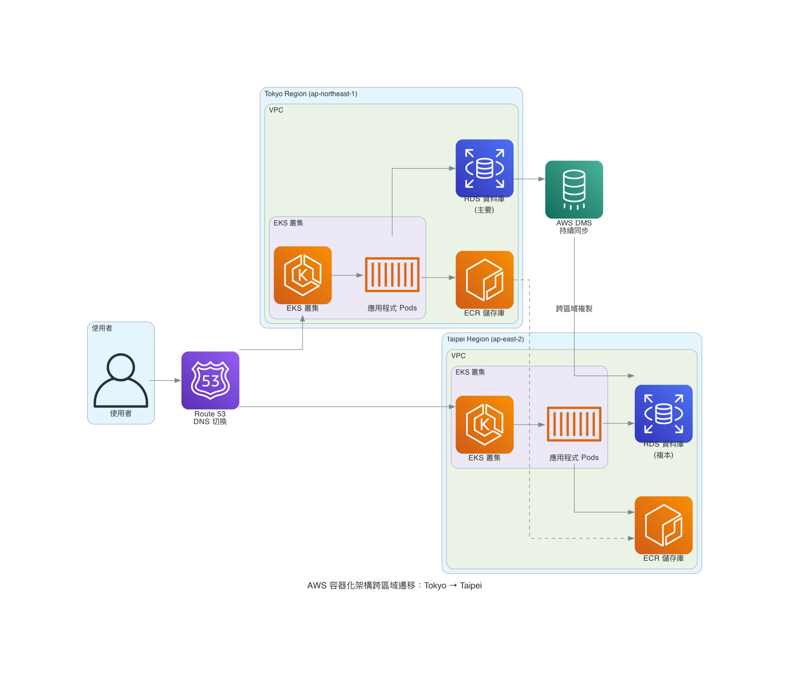

# AWS 跨區域遷移指南：Tokyo Region 到 Taipei Region

> 此指南全部由 Amazon Q Developer CLI + MCP Server 產生

## 概述

本指南提供從 Tokyo Region (ap-northeast-1) 遷移到 Taipei Region (ap-east-2) 的完整策略，主要針對使用 Amazon EKS、Amazon RDS 和 Amazon ECR 的客戶。

## 快速自我評估

回答以下問題來確定最適合的遷移策略：

1. **基礎設施管理方式**
   - ✅ 使用 CloudFormation/CDK/Terraform → 考慮情境 1 (IaC 重部署)
   - ✅ 手動透過 Console/CLI 管理 → 繼續下一題

2. **應用程式架構類型**
   - ✅ 主要使用 Lambda + API Gateway + DynamoDB → 情境 1
   - ✅ 使用 EKS + RDS + ECR → **本指南適用** (情境 2)
   - ✅ 使用 EC2 + RDS + ELB → 繼續下一題

3. **停機時間容忍度** (針對 EC2 架構)
   - ✅ 完全不能停機 → 情境 3 (零停機遷移)
   - ✅ 可接受 2-4 小時維護窗口 → 情境 4 (計劃停機)

### 決策矩陣

| 如果您的架構是... | 並且... | 那麼推薦... | 預期停機 |
|------------------|---------|-------------|----------|
| Serverless (Lambda+DynamoDB) | 使用 IaC 管理 | 情境 1: 重新部署 | < 5分鐘 |
| 容器化 (EKS+RDS+ECR) | 手動管理 | **本指南**: 叢集重建 | 15-30分鐘 |
| 傳統 (EC2+RDS+ELB) | 24/7 營運需求 | 情境 3: Blue-Green | 0分鐘 |
| 傳統 (EC2+RDS+ELB) | 成本優先 | 情境 4: 快照恢復 | 2-4小時 |

## 遷移決策樹

### 如何選擇適合的遷移策略？

根據您的技術架構和業務需求，選擇最適合的遷移方法：

```
AWS 跨區域遷移決策流程
├── 基礎設施管理方式
│   ├── IaC 管理 (CloudFormation/CDK/Terraform)
│   │   ├── 簡單架構 → 直接重新部署 (停機 < 5分鐘)
│   │   └── 複雜架構 → 分階段遷移 (停機 15-30分鐘)
│   └── 手動管理 (Console/CLI)
│       ├── Serverless 架構 (Lambda + API Gateway + DynamoDB)
│       │   └── SAM/CDK 重部署 + Global Tables
│       ├── 容器化架構 (EKS + RDS + ECR) ← 本指南重點
│       │   └── 叢集重建 + ECR 複製 + RDS 跨區域備份
│       └── 傳統架構 (EC2 + RDS + ELB)
│           ├── 零停機需求 → Blue-Green + Route 53
│           └── 可接受停機 → AMI 複製 + 快照恢復
```

### 四大典型遷移情境

| 情境 | 架構類型 | 管理方式 | 預期停機 | 適用客戶 |
|------|----------|----------|----------|----------|
| **情境 1** | Serverless | IaC | < 5分鐘 | 現代化無狀態應用 |
| **情境 2** | 容器化 | 手動 | 15-30分鐘 | 微服務架構 (本指南) |
| **情境 3** | 傳統架構 | 手動 | 0分鐘 | 24/7 營運需求 |
| **情境 4** | 傳統架構 | 手動 | 2-4小時 | 成本敏感型客戶 |

## 遷移架構圖



## 適用客戶條件

### ✅ 最適合的客戶特徵

**技術架構**：
- 使用 Amazon EKS + Amazon RDS + Amazon ECR 的組合架構
- 手動透過 AWS Console 或 AWS CLI 建立的服務
- 缺乏完整的 AWS CloudFormation 或 AWS CDK 管理
- 已在 Tokyo Region 使用多可用區部署

**業務需求**：
- 需要完全一致的配置複製到新區域
- 要求最小停機時間（RTO < 30分鐘）
- 資料遺失容忍度低（RPO < 15分鐘）
- 有明確的遷移時間窗口

**組織能力**：
- 具備 AWS CLI 和 kubectl 操作經驗
- 有 24/7 監控和應急響應能力
- 能承受 1-2 週的雙重環境成本
- 有測試環境可以先行驗證

### ❌ 不適用的客戶類型

- 已完全使用 AWS CloudFormation 或 AWS CDK 管理基礎設施
- 純 Serverless 架構（AWS Lambda + Amazon API Gateway + Amazon DynamoDB）
- 只使用單一 AWS 服務的簡單架構
- 缺乏 Kubernetes 和容器技術經驗

## 其他遷移情境參考

雖然本指南專注於容器化架構遷移，以下提供其他情境的簡要策略供參考：

### 情境 1: IaC 管理的 Serverless 架構
**適用**: SAM/CDK 管理的 Lambda + API Gateway + DynamoDB
- **策略**: 更新區域參數重新部署 + DynamoDB Global Tables
- **停機時間**: < 5 分鐘
- **關鍵步驟**: 程式碼重部署 → Global Tables 啟用 → DNS 切換

### 情境 3: 零停機傳統架構遷移
**適用**: EC2 + RDS + ELB，24/7 營運需求
- **策略**: Blue-Green 部署 + DMS 單向同步 + Route 53 加權路由
- **停機時間**: 0 分鐘
- **關鍵步驟**: 平行環境建立 → 資料單向同步 → 漸進式流量切換

### 情境 4: 計劃停機傳統架構遷移
**適用**: EC2 + RDS + ELB，成本優先考量
- **策略**: AMI 跨區域複製 + RDS 快照恢復 + DNS 直接切換
- **停機時間**: 2-4 小時
- **關鍵步驟**: AMI 複製 → 快照恢復 → 執行個體啟動 → DNS 更新

---

## 遷移策略 (容器化架構專用)

### 1. Amazon RDS 遷移策略

**推薦方法**：RDS 跨區域自動備份複製 + AWS DMS 持續同步

**實作步驟**：

1. **啟用跨區域備份複製**
   - 在 Taipei Region 啟用 RDS 自動備份複製
   - 設定 7-14 天備份保留期間

2. **建立目標資料庫**
   - 從跨區域備份建立新 RDS 執行個體
   - 確保相同規格和引擎版本

3. **設定 DMS 持續同步**
   - 建立 DMS 複製執行個體
   - 設定來源和目標端點
   - 啟動 CDC 複製任務

**預期指標**：
- **RPO**: 5-15 分鐘（透過 AWS DMS 持續同步）
- **RTO**: 15-30 分鐘（自動化切換）

### 2. Amazon EKS 遷移策略

**推薦方法**：設定匯出 + 基礎設施重建 + 應用程式狀態遷移

**關鍵注意事項**：
- EKS 叢集無法直接跨區域遷移，必須重新建立
- 需要保留所有 Kubernetes 資源設定和狀態
- 注意 LoadBalancer 和 Ingress 的區域特定設定
- **Stateful 應用程式**：需要額外處理 Persistent Volume 資料遷移
- **Stateless 應用程式**：可以直接重新部署，無需資料遷移

**實作步驟**：

1. **匯出現有叢集設定**
   - 記錄 EKS 叢集版本、節點群組設定
   - 匯出所有 Kubernetes 資源設定
   - **識別 Stateful 應用程式**：檢查 StatefulSet、PVC 使用情況
   - 記錄服務帳戶設定

2. **建立新 EKS 叢集**
   - 在 Taipei Region 建立相同設定的叢集
   - 設定節點群組和自動擴展設定
   - 安裝必要的 Add-ons

3. **部署應用程式**
   - **Stateless 應用程式**：直接重新部署
   - **Stateful 應用程式**：先恢復 PV 資料，再部署
   - 更新容器映像標籤指向新區域的 ECR
   - 驗證應用程式功能和整合測試

### Stateful 應用程式資料遷移方法

> **注意**：資料庫資料已透過 RDS 遷移策略處理，此處僅針對其他 Stateful 應用程式（如檔案儲存、快取等）

**方法 1：EBS 快照跨區域複製**
1. 為 Persistent Volume 建立 EBS 快照
2. 將快照複製到 Taipei Region
3. 在新區域從快照建立新的 EBS 磁碟區
4. 重新部署應用程式並掛載新磁碟區

**方法 2：應用程式層級備份**
1. 使用應用程式原生備份功能（如檔案同步、快取匯出）
2. 將備份檔案上傳到 S3
3. 在新區域部署應用程式
4. 從 S3 下載並還原備份資料

### 3. Amazon ECR 遷移策略

**推薦方法**：ECR 跨區域自動複製

**實作步驟**：

1. **設定跨區域複製**
   - 建立複製規則設定檔
   - 在來源區域套用複製設定
   - 確認目標區域的儲存庫已自動建立

2. **處理現有映像**
   - 識別需要遷移的現有容器映像
   - 手動觸發現有映像的跨區域複製
   - 驗證所有標籤和映像層都已正確複製

3. **驗證複製完整性**
   - 檢查目標區域的映像清單
   - 比對映像摘要確保一致性
   - 測試從新區域拉取映像的功能

## 遷移時程規劃

### 階段 1：準備 (1-2 週)
- [ ] 災難恢復需求評估（RTO/RPO）
- [ ] Amazon ECR 複製規則設定
- [ ] Taipei Region 基礎網路建立
- [ ] 安全群組設定
- [ ] 測試環境建立和驗證

### 階段 2：遷移 (1 週)
- [ ] 啟用 RDS 跨區域自動備份複製
- [ ] AWS DMS 複製任務啟動
- [ ] 建立 Taipei EKS 叢集
- [ ] 應用程式設定部署
- [ ] 功能和整合測試

### 階段 3：切換與驗證 (1 週)
- [ ] Route 53 DNS 記錄準備
- [ ] 漸進式流量切換（10% → 50% → 100%）
- [ ] 監控和效能驗證
- [ ] 完成遷移確認

## DNS 切換與回滾策略

### DNS 切換計畫
1. **準備階段**
   - 降低 DNS TTL 至 60 秒
   - 準備新區域的 DNS 記錄
   - 設定 Route 53 健康檢查

2. **漸進式切換**
   - 使用加權路由政策
   - 10% → 50% → 100% 流量切換
   - 每階段監控 15 分鐘

3. **驗證完成**
   - 確認所有服務正常運作
   - 監控關鍵指標 24 小時

### 快速回滾程序
**觸發條件**：
- 應用程式錯誤率 > 5%
- 回應時間增加 > 50%
- 資料同步異常

**回滾步驟**：
1. 立即將 DNS 切回 Tokyo Region (< 5 分鐘)
2. 停止 DMS 同步任務
3. 驗證 Tokyo 服務恢復正常
4. 分析問題並重新規劃

## 監控與驗證

### Amazon RDS 遷移監控
**關鍵監控項目**：
- AWS DMS 任務狀態和進度監控
- 資料同步延遲時間追蹤
- 錯誤日誌和異常事件檢查

**驗證步驟**：
- 比對來源和目標資料庫的資料筆數
- 執行資料完整性檢查查詢
- 測試應用程式連線和查詢效能

### Amazon EKS 健康檢查
**叢集層級檢查**：
- 節點狀態和資源使用率
- 控制平面 API 回應時間
- 網路連線和 DNS 解析功能

**應用程式層級檢查**：
- Pod 運行狀態和重啟次數
- Service 端點和負載平衡功能
- Ingress 路由和 SSL 憑證狀態

### Amazon ECR 複製狀態
**複製狀態檢查**：
- 複製規則設定和啟用狀態
- 目標區域儲存庫建立狀況
- 映像複製進度和完成狀態

**映像完整性驗證**：
- 比對映像摘要值確保一致性
- 驗證所有標籤都已正確複製
- 測試從新區域拉取映像的功能

## 成本最佳化

### 預期成本項目
- **Amazon ECR 複製**：跨區域資料傳輸 + 雙重儲存成本
- **AWS DMS**：複製執行個體按小時計費 + 跨區域資料傳輸
- **雙重環境**：1-2 週並行運行成本

### 最佳化建議
- 選擇適當的 AWS DMS 執行個體大小
- 遷移完成後及時清理暫時資源
- 考慮使用 Amazon EC2 Spot 執行個體進行測試

## 風險控制與回滾策略

### 快速回滾機制
**DNS 切換回滾**：
- 準備 Amazon Route 53 回滾變更集
- 使用預先配置的 DNS 記錄快速切回
- 確保 TTL 設定允許快速生效

### 資料一致性保證
- AWS DMS 單向同步設定
- 15 分鐘內完成流量切回
- 多重備份機制確保資料安全

### 風險緩解措施
- 完整的測試環境驗證
- 分階段流量切換
- 24/7 監控和告警機制
- 詳細的回滾程序文件

## 成功指標

### 技術指標
- **RTO 達成**：< 30 分鐘
- **RPO 達成**：< 15 分鐘
- **設定一致性**：100% 相同
- **應用程式可用性**：99.9%+

### 業務指標
- **遷移時程**：3 週內完成
- **成本控制**：預算範圍內
- **零資料遺失**：確保資料完整性
- **使用者體驗**：無感知切換

## 支援資源

### AWS 服務文件
- [Amazon RDS 跨區域災難恢復](https://docs.aws.amazon.com/prescriptive-guidance/latest/dr-standard-edition-amazon-rds/design-cross-region-dr.html)
- [Amazon ECR 跨區域複製](https://docs.aws.amazon.com/AmazonECR/latest/userguide/replication.html)
- [Amazon EKS 最佳實踐](https://docs.aws.amazon.com/eks/latest/best-practices/)
- [AWS Database Migration Service 最佳實踐](https://docs.aws.amazon.com/dms/latest/userguide/CHAP_BestPractices.html)

### 聯絡支援
如需進一步協助，請聯絡您的 AWS Solutions Architect 或透過 AWS Support 提交技術支援請求。

---

**版本**: 1.0  
**最後更新**: 2025-09-02  
**適用區域**: Tokyo Region (ap-northeast-1) → Taipei Region (ap-east-2)
