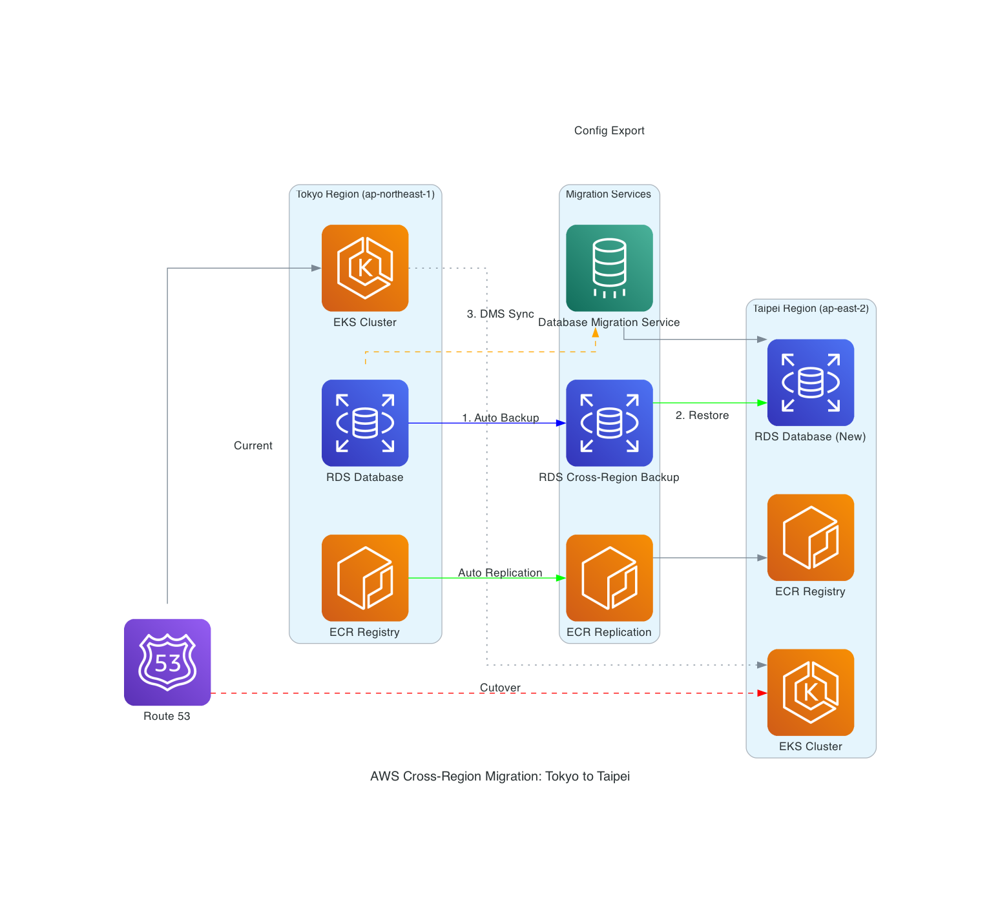

# AWS 跨區域遷移指南：Tokyo Region 到 Taipei Region

>  此指南全部由 Amazon Q Developer CLI + MCP Server 產生

## 概述

本指南提供從 Tokyo Region (ap-northeast-1) 遷移到 Taipei Region (ap-east-2) 的完整策略，主要針對使用 Amazon EKS、Amazon RDS 和 Amazon ECR 的客戶。

## 遷移架構圖



## 適用客戶條件

### ✅ 最適合的客戶特徵

**技術架構**：
- 使用 Amazon EKS + Amazon RDS + Amazon ECR 的組合架構
- 手動透過 AWS Console 或 AWS CLI 建立的服務
- 缺乏完整的 AWS CloudFormation 或 AWS CDK 管理
- 已在 Tokyo Region 使用多可用區部署

**業務需求**：
- 需要完全一致的配置複製到新區域
- 要求最小停機時間（RTO < 30分鐘）
- 資料遺失容忍度低（RPO < 15分鐘）
- 有明確的遷移時間窗口

**組織能力**：
- 具備 AWS CLI 和 kubectl 操作經驗
- 有 24/7 監控和應急響應能力
- 能承受 1-2 週的雙重環境成本
- 有測試環境可以先行驗證

### ❌ 不適用的客戶類型

- 已完全使用 AWS CloudFormation 或 AWS CDK 管理基礎設施
- 純 Serverless 架構（AWS Lambda + Amazon API Gateway + Amazon DynamoDB）
- 只使用單一 AWS 服務的簡單架構
- 缺乏 Kubernetes 和容器技術經驗

## 遷移策略

### 1. Amazon RDS 遷移策略

**推薦方法**：RDS 跨區域自動備份複製 + AWS DMS 持續同步

**技術實作**：
```bash
# 1. 啟用 RDS 跨區域自動備份複製（在目標區域執行）
aws rds start-db-instance-automated-backups-replication \
  --source-db-instance-arn arn:aws:rds:ap-northeast-1:ACCOUNT-ID:db:tokyo-db \
  --backup-retention-period 7 \
  --region ap-east-2

# 2. 從跨區域自動備份恢復 DB 實例（使用時間點恢復）
aws rds restore-db-instance-to-point-in-time \
  --source-db-instance-automated-backups-arn arn:aws:rds:ap-east-2:ACCOUNT-ID:auto-backup:ab-EXAMPLE \
  --target-db-instance-identifier taipei-db \
  --db-instance-class db.t3.medium \
  --region ap-east-2

# 3. 建立 table-mappings.json 檔案
cat > table-mappings.json << 'EOF'
{
  "rules": [
    {
      "rule-type": "selection",
      "rule-id": "1",
      "rule-name": "include-all-tables",
      "object-locator": {
        "schema-name": "%",
        "table-name": "%"
      },
      "rule-action": "include"
    }
  ]
}
EOF

# 4. 建立 AWS DMS 複製執行個體
aws dms create-replication-instance \
  --replication-instance-identifier migration-instance \
  --replication-instance-class dms.t3.medium \
  --allocated-storage 100 \
  --region ap-east-2

# 5. 建立 DMS 來源端點
aws dms create-endpoint \
  --endpoint-identifier tokyo-source-endpoint \
  --endpoint-type source \
  --engine-name mysql \
  --server-name tokyo-db.cluster-xyz.ap-northeast-1.rds.amazonaws.com \
  --port 3306 \
  --username admin \
  --password your-password \
  --region ap-east-2

# 6. 建立 DMS 目標端點
aws dms create-endpoint \
  --endpoint-identifier taipei-target-endpoint \
  --endpoint-type target \
  --engine-name mysql \
  --server-name taipei-db.cluster-xyz.ap-east-2.rds.amazonaws.com \
  --port 3306 \
  --username admin \
  --password your-password \
  --region ap-east-2

# 7. 建立 DMS 複製任務（從 Tokyo 到 Taipei）
aws dms create-replication-task \
  --replication-task-identifier tokyo-to-taipei-sync \
  --source-endpoint-arn arn:aws:dms:ap-east-2:ACCOUNT-ID:endpoint:tokyo-source-endpoint \
  --target-endpoint-arn arn:aws:dms:ap-east-2:ACCOUNT-ID:endpoint:taipei-target-endpoint \
  --replication-instance-arn arn:aws:dms:ap-east-2:ACCOUNT-ID:rep:migration-instance \
  --migration-type cdc \
  --table-mappings file://table-mappings.json
```

**預期指標**：
- **RPO**: 5-15 分鐘（透過 AWS DMS 持續同步）
- **RTO**: 15-30 分鐘（自動化切換）

### 2. Amazon EKS 遷移策略

**推薦方法**：配置即代碼 + 應用程式狀態遷移

**技術實作**：
```bash
# 1. 匯出現有叢集配置
aws eks update-kubeconfig --region ap-northeast-1 --name tokyo-cluster
kubectl get all --all-namespaces -o yaml > cluster-backup.yaml

# 2. 匯出其他重要資源
kubectl get configmaps --all-namespaces -o yaml > configmaps-backup.yaml
kubectl get secrets --all-namespaces -o yaml > secrets-backup.yaml
kubectl get pvc --all-namespaces -o yaml > pvc-backup.yaml

# 3. 建立 Taipei 叢集配置檔
cat > taipei-cluster-config.yaml << 'EOF'
apiVersion: eksctl.io/v1alpha5
kind: ClusterConfig

metadata:
  name: taipei-cluster
  region: ap-east-2

managedNodeGroups:
  - name: taipei-workers
    instanceType: m5.large
    desiredCapacity: 2
    minSize: 1
    maxSize: 4
    volumeSize: 20
    ssh:
      allow: true
EOF

# 4. 使用 eksctl 配置檔建立新叢集
eksctl create cluster -f taipei-cluster-config.yaml

# 5. 切換到新叢集並部署應用程式
aws eks update-kubeconfig --region ap-east-2 --name taipei-cluster
kubectl apply -f cluster-backup.yaml
kubectl apply -f configmaps-backup.yaml
kubectl apply -f secrets-backup.yaml
kubectl apply -f pvc-backup.yaml
```

### 3. Amazon ECR 遷移策略

**推薦方法**：ECR 跨區域自動複製

**複製配置**：
```json
{
  "rules": [
    {
      "destinations": [
        {
          "region": "ap-east-2",
          "registryId": "123456789012"
        }
      ],
      "repositoryFilters": [
        {
          "filter": "*",
          "filterType": "PREFIX_MATCH"
        }
      ]
    }
  ]
}
```

**現有映像遷移**：
```bash
# 設定 ECR 複製規則
aws ecr put-replication-configuration \
  --replication-configuration file://replication-config.json \
  --region ap-northeast-1

# 手動觸發現有映像複製
for repo in $(aws ecr describe-repositories --region ap-northeast-1 --query 'repositories[].repositoryName' --output text); do
  aws ecr batch-get-image --repository-name $repo --region ap-northeast-1 \
    --image-ids imageTag=latest --query 'images[].imageManifest' --output text | \
  aws ecr put-image --repository-name $repo --region ap-east-2 \
    --image-manifest file:///dev/stdin --image-tag latest
done
```

## 遷移時程規劃

### 第 0 週：規劃與準備
- [ ] 災難恢復需求評估（RTO/RPO）
- [ ] 依賴關係分析和風險評估
- [ ] Amazon ECR 複製規則配置（提前開始背景同步）
- [ ] 測試環境建立和驗證

### 第 1 週：基礎設施準備
- [ ] Taipei Region 基礎網路建立（Amazon VPC、子網路）
- [ ] IAM 角色和安全群組配置
- [ ] Amazon ECR 複製驗證
- [ ] 準備 DMS 相關配置檔案

### 第 2 週：資料庫遷移執行
- [ ] 啟用 RDS 跨區域自動備份複製
- [ ] 從自動備份恢復建立新的 DB 實例
- [ ] 建立 table-mappings.json 配置檔
- [ ] 建立 AWS DMS 複製執行個體和端點
- [ ] AWS DMS 複製任務啟動和監控
- [ ] 資料一致性驗證
- [ ] 效能基準測試

### 第 3 週：EKS 叢集建立與應用部署
- [ ] 匯出現有 EKS 叢集配置和資源
- [ ] 建立 Taipei 叢集配置檔（taipei-cluster-config.yaml）
- [ ] Amazon EKS 叢集建立
- [ ] 應用程式配置部署
- [ ] 服務發現和負載平衡配置
- [ ] 功能和整合測試

### 第 4 週：流量切換與驗證
- [ ] Amazon Route 53 DNS 記錄準備
- [ ] 漸進式流量切換（10% → 50% → 100%）
- [ ] 監控和效能驗證
- [ ] 完成遷移確認

## 監控與驗證

### Amazon RDS 遷移監控
```bash
# AWS DMS 任務狀態監控
aws dms describe-replication-tasks \
  --filters Name=replication-task-id,Values=task-id \
  --region ap-east-2

# 資料一致性檢查
aws rds describe-db-instances \
  --db-instance-identifier taipei-db \
  --region ap-east-2
```

### Amazon EKS 健康檢查
```bash
# 叢集狀態驗證
kubectl get nodes --show-labels
kubectl get pods --all-namespaces
kubectl get services --all-namespaces
```

### Amazon ECR 同步狀態
```bash
# 複製狀態檢查
aws ecr describe-registry --region ap-east-2 \
  --query 'replicationConfiguration.rules[].destinations[].region'

# 映像完整性驗證
aws ecr describe-images --repository-name app-repo --region ap-east-2
```

## 成本最佳化

### 預期成本項目
- **Amazon ECR 複製**：跨區域資料傳輸 $0.02/GB + 雙重儲存成本
- **AWS DMS**：複製執行個體按小時計費 + 跨區域資料傳輸
- **雙重環境**：1-2 週並行運行成本

### 最佳化建議
- 使用 VPC Peering 降低資料傳輸成本
- 選擇適當的 AWS DMS 執行個體大小
- 遷移完成後及時清理暫時資源
- 考慮使用 Amazon EC2 Spot 執行個體進行測試

## 風險控制與回滾策略

### 快速回滾機制
```bash
# Amazon Route 53 DNS 快速切回
aws route53 change-resource-record-sets \
  --hosted-zone-id Z123456789 \
  --change-batch file://rollback-changeset.json
```

### 資料一致性保證
- AWS DMS 雙向同步配置
- 15 分鐘內完成流量切回
- 多重備份機制確保資料安全

### 風險緩解措施
- 完整的測試環境驗證
- 分階段流量切換
- 24/7 監控和告警機制
- 詳細的回滾程序文件

## 成功指標

### 技術指標
- **RTO 達成**：< 30 分鐘
- **RPO 達成**：< 15 分鐘
- **配置一致性**：100% 相同
- **應用程式可用性**：99.9%+

### 業務指標
- **遷移時程**：4 週內完成
- **成本控制**：預算範圍內
- **零資料遺失**：確保資料完整性
- **使用者體驗**：無感知切換

## 支援資源

### AWS 服務文件
- [Amazon RDS 跨區域災難恢復](https://docs.aws.amazon.com/prescriptive-guidance/latest/dr-standard-edition-amazon-rds/design-cross-region-dr.html)
- [Amazon ECR 跨區域複製](https://docs.aws.amazon.com/AmazonECR/latest/userguide/replication.html)
- [Amazon EKS 最佳實踐](https://docs.aws.amazon.com/eks/latest/best-practices/)
- [AWS Database Migration Service 最佳實踐](https://docs.aws.amazon.com/dms/latest/userguide/CHAP_BestPractices.html)

### 聯絡支援
如需進一步協助，請聯絡您的 AWS Solutions Architect 或透過 AWS Support 提交技術支援請求。

---

**版本**: 1.0  
**最後更新**: 2025-06-12  
**適用區域**: Tokyo Region (ap-northeast-1) → Taipei Region (ap-east-2)
