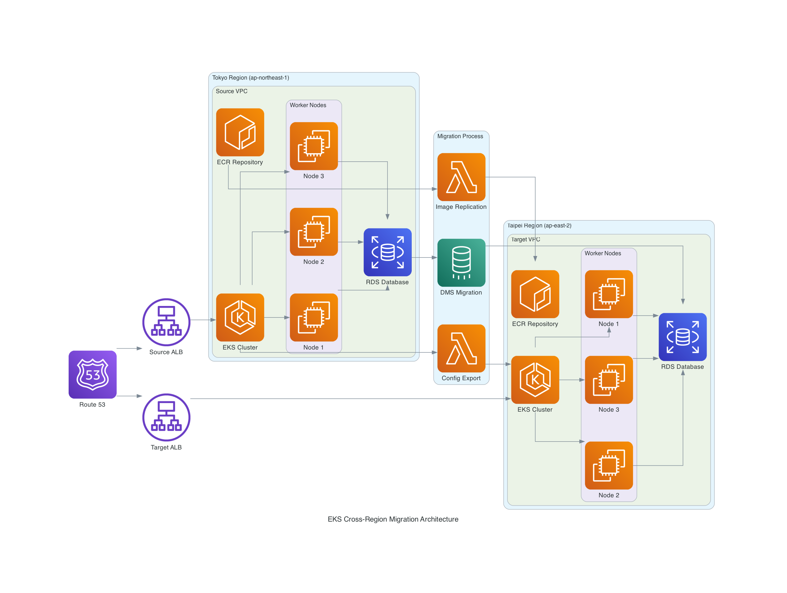
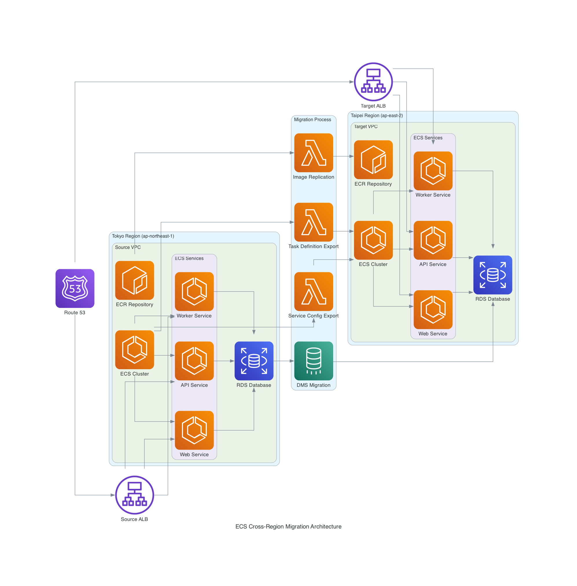
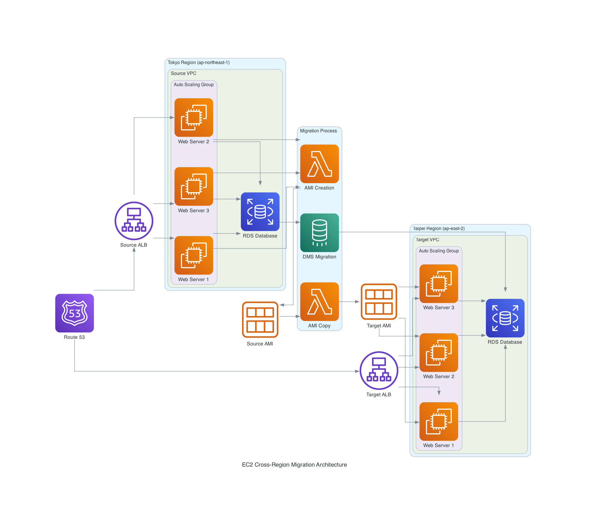

# AWS 跨區域工作負載遷移架構設計指南

## 概述

本指南專注於如何根據 Tokyo Region 現有的 AWS 服務，設計最適合的遷移策略到 Taipei Region。重點在於遷移方法選擇、架構設計考量，以及各種遷移策略的優缺點分析。

## 適用條件與場景

### 🎯 **主要適用場景**

本指南特別適合以下情況：

#### 1. **非 IaC 管理的現有環境**
- **手動建立的基礎設施**：透過 AWS Console、CLI 或 API 手動建立的服務
- **缺乏完整 IaC 代碼**：沒有 CloudFormation、Terraform、CDK 等基礎設施即代碼
- **配置文件散失**：原始建立的配置參數已經遺失或不完整
- **多人協作建立**：由不同團隊成員在不同時期建立，缺乏統一管理

#### 2. **需要完全一致性複製**
- **生產環境複製**：需要將生產環境完全相同地複製到新區域
- **配置參數保持**：所有設定、標籤、政策都需要保持一致
- **避免人為錯誤**：手動重建容易遺漏細節或產生差異
- **合規性要求**：需要確保兩個區域的配置完全相同以符合合規要求

#### 3. **緊急遷移需求**
- **區域服務中斷**：原區域發生服務中斷需要快速遷移
- **法規合規要求**：因法規變更需要將服務遷移到特定區域
- **成本最佳化**：新區域提供更好的成本效益
- **延遲最佳化**：為了改善使用者體驗需要遷移到更近的區域

### ❌ **不適用的場景**

以下情況**不建議**使用本指南：

#### 1. **已有完整 IaC 管理**
```bash
# 如果您已經有這些，建議直接使用 IaC 重新部署
├── terraform/
│   ├── main.tf
│   ├── variables.tf
│   └── modules/
├── cloudformation/
│   ├── template.yaml
│   └── parameters.json
└── cdk/
    ├── app.py
    └── stacks/
```

**建議做法**：
- **Terraform**：修改 provider region 後執行 `terraform plan` 和 `terraform apply`
- **CloudFormation**：在新區域部署相同的模板
- **CDK**：修改區域設定後重新部署
- **Pulumi**：更新配置後執行部署

#### 2. **容器化應用程式**
如果您的應用程式已經完全容器化且使用：
- **Kubernetes YAML 檔案**：可直接在新 EKS 叢集部署
- **Docker Compose**：可在新環境直接啟動
- **Helm Charts**：可直接安裝到新叢集

#### 3. **微服務架構**
對於已經採用微服務架構的應用程式：
- 每個服務都有獨立的部署腳本
- 使用 CI/CD 管道自動部署
- 服務間通過 API 通訊，區域遷移相對簡單

### ✅ **最適合的使用情境**

#### 情境 1：傳統企業環境
```
現況：
- EKS 叢集透過 Console 手動建立
- 節點群組配置複雜，包含多種執行個體類型
- 安全群組規則經過多次調整
- IAM 角色和政策經過客製化修改

挑戰：
- 無法確定所有配置細節
- 擔心手動重建會遺漏設定
- 需要確保新環境與現有環境完全一致
```

#### 情境 2：快速擴展需求
```
現況：
- 現有 Tokyo Region 的服務運行良好
- 需要在 Taipei Region 建立相同的環境
- 時間緊迫，無法重新設計架構
- 需要保持兩個區域的一致性

需求：
- 快速複製現有環境
- 確保配置完全相同
- 最小化停機時間
- 保持服務品質
```

#### 情境 3：災難恢復準備
```
現況：
- 主要服務在單一區域運行
- 需要建立跨區域的災難恢復環境
- 現有環境配置複雜
- 需要定期同步兩個環境

要求：
- 備援環境與主環境完全相同
- 能夠快速切換流量
- 資料同步機制
- 定期驗證備援環境
```

### 🔄 **與 IaC 方案的比較**

| 比較項目 | 本指南方案 | IaC 方案 |
|---------|-----------|----------|
| **適用場景** | 非 IaC 管理的現有環境 | 已有 IaC 代碼的環境 |
| **配置一致性** | 100% 複製現有配置 | 依據 IaC 代碼重建 |
| **執行時間** | 1-2 週 | 數天到 1 週 |
| **技術門檻** | 中等（需要 AWS CLI 經驗） | 高（需要 IaC 工具經驗） |
| **維護性** | 適合一次性遷移 | 長期維護性佳 |
| **風險控制** | 高（完全複製現有配置） | 中等（依據代碼品質） |

### 📋 **使用前檢查清單**

在使用本指南前，請確認：

- [ ] **現有環境非 IaC 管理**：沒有完整的 Terraform、CloudFormation 或 CDK 代碼
- [ ] **需要完全一致性**：新環境需要與現有環境完全相同
- [ ] **有適當權限**：具備讀取現有資源和建立新資源的 AWS 權限
- [ ] **時間充裕**：有 1-2 週的時間進行遷移和測試
- [ ] **備份完整**：已經備份所有重要資料和配置
- [ ] **測試環境**：有測試環境可以先行驗證遷移流程

### 💡 **建議的後續步驟**

完成遷移後，建議：

1. **建立 IaC 代碼**：將遷移後的環境轉換為 IaC 管理
2. **文件化配置**：記錄所有重要的配置和決策
3. **自動化部署**：建立 CI/CD 管道自動化未來的部署
4. **監控和警示**：設定完整的監控和警示機制
5. **定期同步**：如果需要維護兩個區域，建立同步機制

## 🚀 **進階方案：遷移 + IaC 轉換**

### 適用場景
如果您希望在遷移的同時，將環境轉換為 IaC 管理，可以採用以下進階方案：

#### 階段 1：環境複製與掃描
```bash
# 1. 使用本指南複製環境到新區域
./complete_migration.sh all eks

# 2. 同時掃描現有資源生成 IaC 代碼
./generate_iac_from_existing.sh
```

#### 階段 2：IaC 代碼生成
使用 AWS 官方的 IaC Generator：

**CloudFormation 方案**：
```bash
# 使用 AWS IaC Generator
aws cloudformation create-generated-template \
  --generated-template-name infrastructure-template \
  --resources file://resource-list.json \
  --region $TARGET_REGION
```

### 🔧 **IaC 轉換工具**

| 工具 | 優勢 | 適用場景 |
|------|------|----------|
| **AWS IaC Generator** | 官方支援、準確度高、免費 | AWS 原生環境 |

### 📊 **完整方案時程規劃**

```
Week 1: 環境複製
├── 使用現有指南複製基礎設施
├── 同步執行資源掃描
└── 生成初始 CloudFormation 模板

Week 2: CloudFormation 模板完善
├── 調整和優化生成的模板
├── 加入參數和條件邏輯
└── 建立多環境支援

Week 3: 測試和驗證
├── 在測試環境驗證 CloudFormation 部署
├── 比較手動複製 vs CloudFormation 部署的差異
└── 修正和完善模板

Week 4: 生產環境切換
├── 將現有資源匯入 CloudFormation 管理
├── 建立 CI/CD 管道
└── 文件化和知識轉移
```

### 🎯 **預期效益**

採用進階方案的效益：

1. **短期效益**
   - 快速複製現有環境到新區域
   - 確保配置完全一致
   - 最小化業務中斷

2. **長期效益**
   - 建立 IaC 管理能力
   - 提升部署自動化程度
   - 改善環境一致性和可重複性
   - 降低維護成本

3. **技術債務清理**
   - 將手動管理轉為代碼管理
   - 建立版本控制和變更追蹤
   - 提升團隊 DevOps 能力

## 核心設計原則

### 1. 基於現有服務的遷移策略
- **服務盤點優先**：先分析現有 Region 的服務配置
- **設定完整保留**：最大化保持原有配置和設定
- **最小化變更**：只修改區域特定的必要參數
- **風險最小化**：選擇最穩定可靠的遷移方法

### 2. 遷移方法分類

#### A. 設定匯出型遷移（推薦）
**適用服務：** EKS、ECS、Lambda、API Gateway
**核心概念：** 完整匯出現有設定，修改區域參數後重新部署
**優勢：**
- 100% 設定一致性
- 自動化程度高
- 人為錯誤風險低
- 可重複執行

#### B. 資源複製型遷移
**適用服務：** EC2 (AMI)、RDS (快照)、S3
**核心概念：** 複製資源到目標區域後重新建立
**優勢：**
- 資料完整性保證
- 配置完全相同
- 支援大規模資料遷移

#### C. 混合型遷移
**適用服務：** RDS + DMS、ECR 複製
**核心概念：** 結合多種方法達到最佳效果
**優勢：**
- 最小停機時間
- 資料一致性保證
- 成本效益最佳

## 遷移策略設計框架

### 步驟 1：現有服務盤點與分析

#### 服務相依性分析
```
應用層 (EKS/ECS/EC2)
    ↓
資料層 (RDS/DynamoDB)
    ↓
儲存層 (S3/EFS)
    ↓
網路層 (VPC/ALB/Route53)
```

#### 關鍵評估要素
- **資料量大小**：影響遷移時間和方法選擇
- **服務相依性**：決定遷移順序和並行可能性
- **停機容忍度**：影響遷移策略的激進程度
- **回滾需求**：決定備份和驗證策略

### 步驟 2：遷移方法選擇矩陣

| 現有服務 | 推薦遷移方法 | 關鍵考量 | 預估停機時間 |
|---------|-------------|---------|-------------|
| **EKS 叢集** | 設定匯出 + 重建 | 版本相容性、附加元件 | 0（新叢集） |
| **ECS 叢集** | 設定匯出 + 重建 | 任務定義、服務配置 | 0（新叢集） |
| **EC2 執行個體** | AMI 複製 + 重建 | 執行個體類型支援 | 應用程式切換時間 |
| **RDS 資料庫** | 快照 + DMS 同步 | 資料量、一致性需求 | 5-30 分鐘 |
| **Lambda 函數** | 程式碼重新部署 | 環境變數、觸發器 | 0（版本切換） |
| **S3 儲存桶** | 跨區域複製 | 資料量、同步時間 | 0（漸進同步） |

### 步驟 3：遷移順序設計

#### 標準遷移順序
```
Week 1: 基礎設施準備
├── VPC 和網路元件建立
├── ECR 跨區域複製設定
└── IAM 角色和政策複製

Week 2: 計算服務遷移
├── EKS/ECS/EC2 叢集建立
├── 應用程式部署準備
└── 負載平衡器設定

Week 3: 資料服務遷移
├── RDS 快照建立和複製
├── DMS 差異同步設定
└── 其他資料服務遷移

Week 4: 測試和切換
├── 功能和效能測試
├── DNS 流量漸進切換
└── 監控和最佳化
```

## 各服務遷移策略詳解

### EKS 叢集遷移策略

#### 設計考量
- **叢集設定完整性**：版本、網路、加密設定
- **節點群組配置**：執行個體類型、擴展策略
- **附加元件相容性**：目標區域的支援狀況
- **RBAC 和 IAM 整合**：權限設定的完整遷移

#### 遷移架構



```
Tokyo EKS 叢集
    ↓ (設定匯出)
設定檔案 (JSON)
    ↓ (區域參數修改)
Taipei EKS 叢集
    ↓ (應用程式部署)
Kubernetes 資源遷移
```

#### 關鍵決策點
- **網路設定對應**：子網路和安全群組的正確映射
- **儲存類別驗證**：EBS CSI 驅動程式相容性
- **服務網格整合**：Istio、App Mesh 等的重新配置
- **監控工具整合**：CloudWatch Container Insights 設定

### ECS 叢集遷移策略

#### 設計考量
- **任務定義版本管理**：映像 URI 和環境變數更新
- **服務配置保持**：擴展策略、部署配置
- **網路模式選擇**：awsvpc 模式的子網路對應
- **負載平衡整合**：ALB/NLB 的重新建立

#### 遷移架構



```
Tokyo ECS 服務
    ↓ (任務定義匯出)
任務定義 + 服務配置
    ↓ (映像路徑修改)
Taipei ECS 服務
    ↓ (負載平衡整合)
完整服務重建
```

#### 關鍵決策點
- **容量提供者策略**：Fargate vs EC2 的成本考量
- **服務發現配置**：Cloud Map 命名空間遷移
- **日誌和監控**：CloudWatch Logs 群組重建
- **秘密管理**：Parameter Store/Secrets Manager 整合

### EC2 工作負載遷移策略

#### 設計考量
- **AMI 相容性**：目標區域的執行個體類型支援
- **應用程式狀態**：有狀態 vs 無狀態的處理方式
- **自動化程度**：User Data 腳本的區域適配
- **彈性和擴展**：Auto Scaling 策略的重新設計

#### 遷移架構



```
Tokyo EC2 執行個體
    ↓ (AMI 建立)
自訂 AMI
    ↓ (跨區域複製)
Taipei AMI
    ↓ (啟動範本建立)
Auto Scaling 群組
```

#### 關鍵決策點
- **狀態資料處理**：本地儲存 vs 外部儲存
- **網路介面配置**：彈性 IP 和 ENI 的重新分配
- **備份策略整合**：EBS 快照和 AMI 管理
- **效能最佳化**：執行個體類型的升級機會

### RDS 資料庫遷移策略

#### 設計考量
- **資料完整性**：快照時間點的一致性
- **停機時間最小化**：DMS 差異同步的效益
- **效能影響**：遷移過程對生產環境的影響
- **合規性要求**：資料加密和存取控制

#### 遷移架構
```
Tokyo RDS 執行個體
    ↓ (快照建立)
RDS 快照
    ↓ (跨區域複製)
Taipei RDS 執行個體
    ↓ (DMS 差異同步)
資料一致性保證
```

#### 關鍵決策點
- **快照策略**：完整備份 vs 增量備份
- **DMS 配置**：複製執行個體規格和網路設定
- **切換時機**：業務低峰期的選擇
- **驗證機制**：資料一致性的檢查方法

## 網路架構遷移設計

### VPC 和子網路策略
- **CIDR 規劃**：避免與現有網路衝突
- **可用區域對應**：確保高可用性設計
- **路由表配置**：流量路由的正確設定
- **NAT Gateway 配置**：出站流量的處理

### 安全群組和 NACL
- **規則完整遷移**：保持相同的安全政策
- **相依性處理**：群組間引用的正確對應
- **最小權限原則**：遷移時的安全檢視機會

### DNS 和流量管理
- **Route 53 配置**：健康檢查和故障轉移
- **流量分配策略**：加權路由的漸進切換
- **SSL/TLS 憑證**：Certificate Manager 的區域對應

## 監控和可觀測性設計

### CloudWatch 整合策略
- **指標收集**：自訂指標的重新配置
- **日誌管理**：日誌群組和保留政策
- **警示設定**：閾值和通知目標更新
- **儀表板重建**：監控視覺化的完整遷移

### 應用程式效能監控
- **分散式追蹤**：X-Ray 整合的區域考量
- **錯誤追蹤**：應用程式錯誤監控的設定
- **使用者體驗監控**：Real User Monitoring 配置

## 成本最佳化設計

### 遷移期間成本控制
- **並行處理**：減少總體遷移時間
- **資源調度**：避免不必要的資源重疊
- **測試環境管理**：臨時資源的生命週期管理

### 長期成本最佳化
- **執行個體大小調整**：基於實際使用量優化
- **儲存最佳化**：選擇適當的儲存類型
- **預留執行個體規劃**：長期運行工作負載的成本節省

## 風險管理和緩解策略

### 技術風險
- **版本相容性**：服務版本在目標區域的支援
- **效能差異**：網路延遲和頻寬的影響
- **資料遺失風險**：多重備份和驗證機制

### 業務風險
- **服務中斷**：最小化停機時間的策略
- **使用者體驗**：效能和功能的一致性保證
- **合規性風險**：資料主權和法規要求

### 緩解措施
- **段階式遷移**：降低單次變更的影響範圍
- **完整測試**：功能、效能、安全性的全面驗證
- **快速回滾**：緊急情況下的恢復機制
- **監控加強**：遷移期間的密集監控

## 遷移後最佳化

### 效能調校
- **資源使用率分析**：識別最佳化機會
- **網路最佳化**：延遲和頻寬的改善
- **快取策略**：減少跨區域資料傳輸

### 運維流程更新
- **監控流程**：新區域的監控整合
- **備份策略**：跨區域備份的規劃
- **災難恢復**：更新 DR 計畫和程序
- **文件更新**：架構圖和操作手冊的修訂

## 總結

跨區域遷移的成功關鍵在於：

1. **充分的現有服務分析**：了解所有相依性和配置細節
2. **適當的遷移策略選擇**：根據服務特性選擇最佳方法
3. **系統性的執行規劃**：合理的順序和時程安排
4. **完整的風險管控**：預防措施和應急方案
5. **持續的最佳化改進**：遷移後的效能和成本優化

透過遵循這些設計原則和策略，可以實現高效、安全、成本最佳化的跨區域工作負載遷移。
